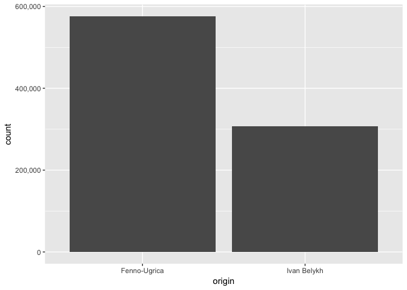

Public Domain Komi-Zyrian data
==============================

-   [Introduction /
    Table](https://github.com/langdoc/kpv-lit#public-domain-komi-zyrian-data)
-   [Missing books](https://github.com/langdoc/kpv-lit#missing-books)
    <!--- [Data in numbers](https://github.com/langdoc/kpv-lit#data-in-numbers)
    - [Discussion on licenses](https://github.com/langdoc/kpv-lit#discussion-on-licenses)
    - [Metadata (to be finished)](https://github.com/langdoc/kpv-lit#metadata)
    - [Citation (to be finished)](https://github.com/langdoc/kpv-lit#data-citation)
    - [Data license](https://github.com/langdoc/kpv-lit#data-license)-->

The table below is generated from the data on tables at page [Коми
(зыряналӧн) небӧг 1920-1938 'Komi (Zyrian) books
1920-1938'](http://wiki.fu-lab.ru/index.php/%D0%9A%D0%BE%D0%BC%D0%B8_(%D0%B7%D1%8B%D1%80%D1%8F%D0%BD%D0%B0%D0%BB%D3%A7%D0%BD)_%D0%BD%D0%B5%D0%B1%D3%A7%D0%B3_1920-1938).
This work is done in [The Finno-Ugric Laboratory for Support of the
Electronic Representation of Regional Languages](http://fu-lab.ru/) in
Syktyvkar. The data collected into this repository is combined from
their [komikyv.org](http://komikyv.org/) website and [Fenno-Ugrica
digical collection of the National Library of
Finland](https://fennougrica.kansalliskirjasto.fi/).

Another component of this repository comes from publications of Ivan
Belykh, which the author [released into Public
Domain](http://news.uralistica.com/?p=6383) in 2013, prior to his death.
These texts are not currently in the table below, but can still be found
from `txt` folder, the metadata related to each text being on the first
line of the file. This will be systematized in the near future.

The organizational work that this repository contains with collecting
texts and checking links has been done by [Niko
Partanen](https://github.com/nikopartanen) and it connects to language
documentation/technology work done in Kone Foundation funded
[IKDP-2](https://langdoc.github.io/IKDP-2/) project and to Niko
Partanen's current work in [LATTICE
laboratory](http://www.lattice.cnrs.fr/) in Paris.

<table>
<thead>
<tr class="header">
<th align="left">year</th>
<th align="left">author</th>
<th align="left">title</th>
<th align="left">fulab_link</th>
<th align="left">fu_link</th>
<th align="left">GitHub</th>
</tr>
</thead>
<tbody>
<tr class="odd">
<td align="left">1925</td>
<td align="left">Кос Кабыр (Худяев И. Е.)</td>
<td align="left">Мувыв тӧдмалӧм. Медводдза нига = Ывлавыв тӧдмалӧм. Арся уджъяс (обл.)</td>
<td align="left"><a href="http://komikyv.org/kpv/contents/yvlavyv-todmalom-1">FU-Lab</a></td>
<td align="left"><a href="http://fennougrica.kansalliskirjasto.fi/handle/10024/67321">Fenno-Ugrica</a></td>
<td align="left"><a href="./txt/fennougrica8763.txt">txt</a></td>
</tr>
<tr class="even">
<td align="left">1925</td>
<td align="left">Исаков В. А.</td>
<td align="left">Крестяна овмӧс бурмӧдӧм йылысь : картупель пуктӧм, анькытш кӧдзӧм, шабді кӧдзӧм.</td>
<td align="left"><a href="http://komikyv.org/kpv/content/krestyana-ovmos-burmodom-yylys">FU-Lab</a></td>
<td align="left"><a href="http://fennougrica.kansalliskirjasto.fi/handle/10024/87322">Fenno-Ugrica</a></td>
<td align="left"><a href="./txt/fennougrica32342.txt">txt</a></td>
</tr>
<tr class="odd">
<td align="left">1926</td>
<td align="left">Россинскӧй П.И.</td>
<td align="left">Нывбаба висьӧмъяс йылысь</td>
<td align="left"><a href="http://komikyv.org/kpv/contents/nyvbaba-visomyas-yylys">FU-Lab</a></td>
<td align="left"><a href="http://fennougrica.kansalliskirjasto.fi/handle/10024/67355">Fenno-Ugrica</a></td>
<td align="left"><a href="./txt/fennougrica8816.txt">txt</a></td>
</tr>
<tr class="even">
<td align="left">1926</td>
<td align="left">Дмитриева В.</td>
<td align="left">Эн эскӧй нинӧм абуӧ</td>
<td align="left"><a href="http://komikyv.org/kpv/content/en-eskoy-ninom-abuo">FU-Lab</a></td>
<td align="left"><a href="http://fennougrica.kansalliskirjasto.fi/handle/10024/67305">Fenno-Ugrica</a></td>
<td align="left"><a href="./txt/fennougrica8735.txt">txt</a></td>
</tr>
<tr class="odd">
<td align="left">1926</td>
<td align="left">Зубрилин А.А., Бауэр А.</td>
<td align="left">Кыдзи крестьяналы кыпӧдны овмӧс</td>
<td align="left"><a href="http://komikyv.org/kpv/contents/kydzi-krestyanaly-kypodny-ovmos">FU-Lab</a></td>
<td align="left"><a href="http://fennougrica.kansalliskirjasto.fi/handle/10024/67317">Fenno-Ugrica</a></td>
<td align="left"><a href="./txt/fennougrica8755.txt">txt</a></td>
</tr>
<tr class="even">
<td align="left">1926</td>
<td align="left">Исаков В.А.</td>
<td align="left">Картупель вӧдитӧм йылысь</td>
<td align="left"><a href="http://komikyv.org/kpv/contents/kartupel-voditom-yylys">FU-Lab</a></td>
<td align="left"><a href="http://fennougrica.kansalliskirjasto.fi/handle/10024/87358">Fenno-Ugrica</a></td>
<td align="left"><a href="./txt/fennougrica32385.txt">txt</a></td>
</tr>
<tr class="odd">
<td align="left">1926</td>
<td align="left"></td>
<td align="left">Комсомол да кооперация</td>
<td align="left"><a href="http://komikyv.org/kpv/contents/komsomol-da-kooperaciya">FU-Lab</a></td>
<td align="left"><a href="http://fennougrica.kansalliskirjasto.fi/handle/10024/67954">Fenno-Ugrica</a></td>
<td align="left"><a href="./txt/fennougrica9984.txt">txt</a></td>
</tr>
<tr class="even">
<td align="left">1927</td>
<td align="left">Беркова К.Н.</td>
<td align="left">Видзчысьӧй да бурдӧдчӧй лёквисьӧмысь</td>
<td align="left"><a href="http://komikyv.org/kpv/contents/vidzchysoy-da-burdodchoy-lyokvisomys">FU-Lab</a></td>
<td align="left"><a href="http://fennougrica.kansalliskirjasto.fi/handle/10024/67290">Fenno-Ugrica</a></td>
<td align="left"><a href="./txt/fennougrica8710.txt">txt</a></td>
</tr>
<tr class="odd">
<td align="left">1927</td>
<td align="left">Гоффеншефер С.</td>
<td align="left">Чакотка</td>
<td align="left"><a href="http://komikyv.org/kpv/contents/chahotka">FU-Lab</a></td>
<td align="left"><a href="http://fennougrica.kansalliskirjasto.fi/handle/10024/87440">Fenno-Ugrica</a></td>
<td align="left"><a href="./txt/fennougrica32480.txt">txt</a></td>
</tr>
<tr class="even">
<td align="left">1927</td>
<td align="left">Коканин Я.С.</td>
<td align="left">Вина юӧм йылысь</td>
<td align="left"><a href="http://komikyv.org/kpv/contents/vina-yuom-yylys">FU-Lab</a></td>
<td align="left"><a href="http://fennougrica.kansalliskirjasto.fi/handle/10024/67307">Fenno-Ugrica</a></td>
<td align="left"><a href="./txt/fennougrica8738.txt">txt</a></td>
</tr>
<tr class="odd">
<td align="left">1927</td>
<td align="left">Коканин Я.С.</td>
<td align="left">Видзчысь лёквисьӧмысь</td>
<td align="left"><a href="http://komikyv.org/kpv/contents/vidzchys-lyokvisomys">FU-Lab</a></td>
<td align="left"><a href="http://fennougrica.kansalliskirjasto.fi/handle/10024/87321">Fenno-Ugrica</a></td>
<td align="left"><a href="./txt/fennougrica32341.txt">txt</a></td>
</tr>
<tr class="even">
<td align="left">1927</td>
<td align="left">Надеин В.В.</td>
<td align="left">Лудӧм</td>
<td align="left"><a href="http://komikyv.org/kpv/contents/ludom">FU-Lab</a></td>
<td align="left"><a href="http://fennougrica.kansalliskirjasto.fi/handle/10024/87331">Fenno-Ugrica</a></td>
<td align="left"><a href="./txt/fennougrica32351.txt">txt</a></td>
</tr>
<tr class="odd">
<td align="left">1927</td>
<td align="left">Фалькнер В.Н.</td>
<td align="left">Лоам ми ёнӧсь, дзоньвидзаӧсь да! : мӧд нига</td>
<td align="left"><a href="http://komikyv.org/kpv/contents/loam-mi-yonos-dzonvidzaos-da">FU-Lab</a></td>
<td align="left"><a href="http://fennougrica.kansalliskirjasto.fi/handle/10024/67982">Fenno-Ugrica</a></td>
<td align="left"><a href="./txt/fennougrica10020.txt">txt</a></td>
</tr>
<tr class="even">
<td align="left">1927</td>
<td align="left">Хрусталёв А.А. (Крустаԉов)</td>
<td align="left">Скӧтсянь мортлы вуджысь висьӧмъяс</td>
<td align="left"><a href="http://komikyv.org/kpv/contents/skotsyan-mortly-vudzhys-visomyas">FU-Lab</a></td>
<td align="left"><a href="http://fennougrica.kansalliskirjasto.fi/handle/10024/67326">Fenno-Ugrica</a></td>
<td align="left"><a href="./txt/fennougrica8770.txt">txt</a></td>
</tr>
<tr class="odd">
<td align="left">1927</td>
<td align="left">Зубрилин А.А.</td>
<td align="left">Бурмӧдӧй видзьястӧ</td>
<td align="left"><a href="http://komikyv.org/kpv/contents/burmodoy-vidzyasto">FU-Lab</a></td>
<td align="left"><a href="http://fennougrica.kansalliskirjasto.fi/handle/10024/67316">Fenno-Ugrica</a></td>
<td align="left"><a href="./txt/fennougrica8752.txt">txt</a></td>
</tr>
<tr class="even">
<td align="left">1927</td>
<td align="left">Штейнберг П.Н.</td>
<td align="left">Мый колӧ тӧдны пуктас вӧдитысьлы</td>
<td align="left"><a href="http://komikyv.org/kpv/contents/myy-kolo-todny-puktas-voditysly">FU-Lab</a></td>
<td align="left"><a href="http://fennougrica.kansalliskirjasto.fi/handle/10024/87354">Fenno-Ugrica</a></td>
<td align="left"><a href="./txt/fennougrica32379.txt">txt</a></td>
</tr>
<tr class="odd">
<td align="left">1928</td>
<td align="left">Канева Н.В.</td>
<td align="left">Нывбабаӧс оласног бурмӧдны велӧдан уджсер</td>
<td align="left"><a href="http://komikyv.org/kpv/contents/nyvbabaos-olasnog-burmodny-velodan-udzhser">FU-Lab</a></td>
<td align="left"><a href="http://fennougrica.kansalliskirjasto.fi/handle/10024/67297">Fenno-Ugrica</a></td>
<td align="left"><a href="./txt/fennougrica8723.txt">txt</a></td>
</tr>
<tr class="even">
<td align="left">1928</td>
<td align="left">Ершов С.А.</td>
<td align="left">Кӧйдысъяс йылысь да кӧдзӧм йылысь</td>
<td align="left"><a href="http://komikyv.org/kpv/contents/koydysyas-yylys-da-koydys-yylys">FU-Lab</a></td>
<td align="left"><a href="http://fennougrica.kansalliskirjasto.fi/handle/10024/67312">Fenno-Ugrica</a></td>
<td align="left"><a href="./txt/fennougrica8746.txt">txt</a></td>
</tr>
<tr class="odd">
<td align="left">1928</td>
<td align="left">Титов П. / Молодцова М. А.</td>
<td align="left">Кыдзи позьӧ бурмӧдны татчӧс скӧт</td>
<td align="left"><a href="http://komikyv.org/kpv/contents/kydzi-pozo-burmodny-tatchos-skot">FU-Lab</a></td>
<td align="left"><a href="http://fennougrica.kansalliskirjasto.fi/handle/10024/87316">Fenno-Ugrica</a></td>
<td align="left"><a href="./txt/fennougrica32335.txt">txt</a></td>
</tr>
<tr class="even">
<td align="left">1929</td>
<td align="left">Гринберг М.</td>
<td align="left">Видзӧй кагалысь бур ун!</td>
<td align="left"><a href="http://komikyv.org/kpv/content/vidzoy-kagalys-bur-un">FU-Lab</a></td>
<td align="left"><a href="http://fennougrica.kansalliskirjasto.fi/handle/10024/87329">Fenno-Ugrica</a></td>
<td align="left"><a href="./txt/fennougrica32349.txt">txt</a></td>
</tr>
<tr class="odd">
<td align="left">1929</td>
<td align="left">Коканин Я.С.</td>
<td align="left">Ревматизм</td>
<td align="left"><a href="http://komikyv.org/kpv/contents/revmatizm">FU-Lab</a></td>
<td align="left"><a href="http://fennougrica.kansalliskirjasto.fi/handle/10024/67308">Fenno-Ugrica</a></td>
<td align="left"><a href="./txt/fennougrica8741.txt">txt</a></td>
</tr>
<tr class="even">
<td align="left">1929</td>
<td align="left">Гешелина Л.С.</td>
<td align="left">Бур сёянӧн кагатӧ верд</td>
<td align="left"><a href="http://komikyv.org/kpv/contents/bur-syoyanon-kagato-verd">FU-Lab</a></td>
<td align="left"><a href="http://fennougrica.kansalliskirjasto.fi/handle/10024/87437">Fenno-Ugrica</a></td>
<td align="left"><a href="./txt/fennougrica32476.txt">txt</a></td>
</tr>
<tr class="odd">
<td align="left">1929</td>
<td align="left">Шабад Й.</td>
<td align="left">Кыдзи видзны кагаӧс 3 арӧссянь 8-ӧдз</td>
<td align="left"><a href="http://komikyv.org/kpv/contents/kydzi-vidzny-kagaos-3-arossyan-8-odz">FU-Lab</a></td>
<td align="left"><a href="http://fennougrica.kansalliskirjasto.fi/handle/10024/87318">Fenno-Ugrica</a></td>
<td align="left"><a href="./txt/fennougrica32338.txt">txt</a></td>
</tr>
<tr class="even">
<td align="left">1929</td>
<td align="left">Очан С. И.</td>
<td align="left">Скӧт дӧзьӧритӧм йылысь</td>
<td align="left"><a href="http://komikyv.org/kpv/contents/skot-dozoritom-yylys">FU-Lab</a></td>
<td align="left"><a href="http://fennougrica.kansalliskirjasto.fi/handle/10024/87346">Fenno-Ugrica</a></td>
<td align="left"><a href="./txt/fennougrica32369.txt">txt</a></td>
</tr>
<tr class="odd">
<td align="left">1929</td>
<td align="left">Ӧльӧк Ӧндрей (Попов А.А.)</td>
<td align="left">Виам вина гагйӧс : вина юӧмкӧд вермасьны отсӧгтор</td>
<td align="left"><a href="http://komikyv.org/kpv/contents/viam-vina-gagyos">FU-Lab</a></td>
<td align="left"><a href="http://fennougrica.kansalliskirjasto.fi/handle/10024/67340">Fenno-Ugrica</a></td>
<td align="left"><a href="./txt/fennougrica8794.txt">txt</a></td>
</tr>
<tr class="even">
<td align="left">1930</td>
<td align="left">Коканин И.С.</td>
<td align="left">Табак куритӧм йылысь</td>
<td align="left"><a href="http://komikyv.org/kpv/content/%D1%82%D0%B0%D0%B1%D0%B0%D0%BA-%D0%BA%D1%83%D1%80%D0%B8%D1%82%D3%A7%D0%BC-%D0%B9%D1%8B%D0%BB%D1%8B%D1%81%D1%8C">FU-Lab</a></td>
<td align="left"><a href="http://fennougrica.kansalliskirjasto.fi/handle/10024/87323">Fenno-Ugrica</a></td>
<td align="left"><a href="./txt/fennougrica32343.txt">txt</a></td>
</tr>
<tr class="odd">
<td align="left">1930</td>
<td align="left">Парначёв П.В.</td>
<td align="left">Муяс бура уджалӧм да вынсьӧдӧм йылысь</td>
<td align="left"><a href="http://komikyv.org/kpv/contents/muyas-bura-udzhalom-da-vynsodom-yylys">FU-Lab</a></td>
<td align="left"><a href="http://fennougrica.kansalliskirjasto.fi/handle/10024/67335">Fenno-Ugrica</a></td>
<td align="left"><a href="./txt/fennougrica8787.txt">txt</a></td>
</tr>
<tr class="even">
<td align="left">1931</td>
<td align="left">Зворыкин П.П.</td>
<td align="left">Бобӧнянь</td>
<td align="left"><a href="http://komikyv.org/kpv/contents/bobonyan">FU-Lab</a></td>
<td align="left"><a href="http://fennougrica.kansalliskirjasto.fi/handle/10024/87438">Fenno-Ugrica</a></td>
<td align="left"><a href="./txt/fennougrica32478.txt">txt</a></td>
</tr>
<tr class="odd">
<td align="left">1931</td>
<td align="left">Васильев А.Ф.</td>
<td align="left">Кыдзи керны да бӧрйыны картупель</td>
<td align="left"><a href="http://komikyv.org/kpv/contents/kydzi-kerny-da-boryyny-kartupel">FU-Lab</a></td>
<td align="left"><a href="http://fennougrica.kansalliskirjasto.fi/handle/10024/87342">Fenno-Ugrica</a></td>
<td align="left"><a href="./txt/fennougrica32357.txt">txt</a></td>
</tr>
<tr class="even">
<td align="left">1931</td>
<td align="left">Филиппов С.Я.</td>
<td align="left">Кыдзи видзны картупель сісьмӧмысь</td>
<td align="left"><a href="http://komikyv.org/kpv/contents/kydzi-vidzny-kartupel-sismomys">FU-Lab</a></td>
<td align="left"><a href="http://fennougrica.kansalliskirjasto.fi/handle/10024/87360">Fenno-Ugrica</a></td>
<td align="left"><a href="./txt/fennougrica32388.txt">txt</a></td>
</tr>
<tr class="odd">
<td align="left">1931</td>
<td align="left">Данилов С.И.</td>
<td align="left">Скӧт кӧрым пуктасъяс вӧдитӧм</td>
<td align="left"><a href="http://komikyv.org/kpv/contents/skot-korym-puktasyas-voditom">FU-Lab</a></td>
<td align="left"><a href="http://fennougrica.kansalliskirjasto.fi/handle/10024/87595">Fenno-Ugrica</a></td>
<td align="left"><a href="./txt/fennougrica32633.txt">txt</a></td>
</tr>
<tr class="even">
<td align="left">1931</td>
<td align="left">Богаевскӧй Г. В.</td>
<td align="left">Кӧрымъяс силосуйтӧм</td>
<td align="left"><a href="http://komikyv.org/kpv/contents/korymyas-silosuytom">FU-Lab</a></td>
<td align="left"><a href="http://fennougrica.kansalliskirjasto.fi/handle/10024/87426">Fenno-Ugrica</a></td>
<td align="left"><a href="./txt/fennougrica32461.txt">txt</a></td>
</tr>
<tr class="odd">
<td align="left">1931</td>
<td align="left">Гиннов В.</td>
<td align="left">Кыдзи да мый силосуйтны колхозъяслы</td>
<td align="left"><a href="http://komikyv.org/kpv/contents/kydzi-da-myy-silosuytny-kolhozyasly">FU-Lab</a></td>
<td align="left"><a href="http://fennougrica.kansalliskirjasto.fi/handle/10024/87597">Fenno-Ugrica</a></td>
<td align="left"><a href="./txt/fennougrica32647.txt">txt</a></td>
</tr>
<tr class="even">
<td align="left">1931</td>
<td align="left">Белов А.</td>
<td align="left">Скӧт видзан ӧтувъя карта</td>
<td align="left"><a href="http://komikyv.org/kpv/contents/skot-vidzan-otuvya-karta">FU-Lab</a></td>
<td align="left"><a href="http://fennougrica.kansalliskirjasto.fi/handle/10024/67927">Fenno-Ugrica</a></td>
<td align="left"><a href="./txt/fennougrica9937.txt">txt</a></td>
</tr>
<tr class="odd">
<td align="left">1931</td>
<td align="left">Домашевская В.А.</td>
<td align="left">Колхозъясын скӧтӧс дӧзьӧритӧм</td>
<td align="left"><a href="http://komikyv.org/kpv/contents/kolhozyasyn-skotos-dozoritom">FU-Lab</a></td>
<td align="left"><a href="http://fennougrica.kansalliskirjasto.fi/handle/10024/87418">Fenno-Ugrica</a></td>
<td align="left"><a href="./txt/fennougrica32453.txt">txt</a></td>
</tr>
<tr class="even">
<td align="left">1931</td>
<td align="left">Осипова Л.</td>
<td align="left">Мый колӧ тӧдны мӧс лысьтысьлы</td>
<td align="left"><a href="http://komikyv.org/kpv/contents/myy-kolo-todny-mos-lystysly">FU-Lab</a></td>
<td align="left"><a href="http://fennougrica.kansalliskirjasto.fi/handle/10024/87326">Fenno-Ugrica</a></td>
<td align="left"><a href="./txt/fennougrica32348.txt">txt</a></td>
</tr>
<tr class="odd">
<td align="left">1931</td>
<td align="left">Есин В.З.</td>
<td align="left">Кутшӧм бур сетӧ трактор</td>
<td align="left"><a href="http://komikyv.org/kpv/contents/kutshom-bur-seto-traktor">FU-Lab</a></td>
<td align="left"><a href="http://fennougrica.kansalliskirjasto.fi/handle/10024/67947">Fenno-Ugrica</a></td>
<td align="left"><a href="./txt/fennougrica9976.txt">txt</a></td>
</tr>
<tr class="even">
<td align="left">1932</td>
<td align="left">Минервин Б.М.</td>
<td align="left">Турун заготовитӧм, прессуйтӧм, хранитӧм, нуӧм : колхозъяслы, совхозъяслы да заготовительяслы практическӧй руководство</td>
<td align="left"><a href="http://komikyv.org/kpv/contents/turun-zagotovitom-pressuytom-kranitom-nuom">FU-Lab</a></td>
<td align="left"><a href="http://fennougrica.kansalliskirjasto.fi/handle/10024/67345">Fenno-Ugrica</a></td>
<td align="left"><a href="./txt/fennougrica8801.txt">txt</a></td>
</tr>
<tr class="odd">
<td align="left">1932</td>
<td align="left">Рейн М.Н.</td>
<td align="left">Кӧрым силосуйтӧмын отсӧг</td>
<td align="left"><a href="http://komikyv.org/kpv/contents/korym-silosuytomyn-otsog">FU-Lab</a></td>
<td align="left"><a href="http://fennougrica.kansalliskirjasto.fi/handle/10024/87417">Fenno-Ugrica</a></td>
<td align="left"><a href="./txt/fennougrica32452.txt">txt</a></td>
</tr>
<tr class="even">
<td align="left">1932</td>
<td align="left">Постников А.С.</td>
<td align="left">Уджалан вӧлӧс дӧзьӧритӧм</td>
<td align="left"><a href="http://komikyv.org/kpv/contents/udzhalan-volos-dozoritom">FU-Lab</a></td>
<td align="left"><a href="http://fennougrica.kansalliskirjasto.fi/handle/10024/87401">Fenno-Ugrica</a></td>
<td align="left"><a href="./txt/fennougrica32430.txt">txt</a></td>
</tr>
<tr class="odd">
<td align="left">1932</td>
<td align="left">Тасин И.С.</td>
<td align="left">Кролик видзысьяслы индӧдъяс</td>
<td align="left"><a href="http://komikyv.org/kpv/contents/krolik-vidzysyasly-indodyas">FU-Lab</a></td>
<td align="left"><a href="http://fennougrica.kansalliskirjasto.fi/handle/10024/87408">Fenno-Ugrica</a></td>
<td align="left"><a href="./txt/fennougrica32438.txt">txt</a></td>
</tr>
<tr class="even">
<td align="left">1932</td>
<td align="left">Калимов А.М.</td>
<td align="left">Мерайтӧмӧн пемӧсъяслысь сьӧкта тӧдмалӧм</td>
<td align="left"><a href="http://komikyv.org/kpv/contents/meraytomon-pemosyaslys-sokta-todmalom">FU-Lab</a></td>
<td align="left"><a href="http://fennougrica.kansalliskirjasto.fi/handle/10024/87447">Fenno-Ugrica</a></td>
<td align="left"><a href="./txt/fennougrica32489.txt">txt</a></td>
</tr>
<tr class="odd">
<td align="left">1932</td>
<td align="left">Пожарицкӧй А.С.</td>
<td align="left">Видзӧй вӧр сотчӧмысь</td>
<td align="left"><a href="http://komikyv.org/kpv/contents/vidzoy-vor-sotchomys">FU-Lab</a></td>
<td align="left"><a href="http://fennougrica.kansalliskirjasto.fi/handle/10024/67339">Fenno-Ugrica</a></td>
<td align="left"><a href="./txt/fennougrica8793.txt">txt</a></td>
</tr>
<tr class="even">
<td align="left">1933</td>
<td align="left">Осипова Л.</td>
<td align="left">Курӧг пӧжӧм да пиянсӧ дӧзьӧритӧм</td>
<td align="left"><a href="http://komikyv.org/kpv/contents/kurog-pozhom-da-piyanso-dozoritom">FU-Lab</a></td>
<td align="left"><a href="http://fennougrica.kansalliskirjasto.fi/handle/10024/87404">Fenno-Ugrica</a></td>
<td align="left"><a href="./txt/fennougrica32434.txt">txt</a></td>
</tr>
<tr class="odd">
<td align="left">1934</td>
<td align="left">Ростовскӧй И.А.</td>
<td align="left">Гӧтрасьӧм, семья да опека</td>
<td align="left"><a href="http://komikyv.org/kpv/contents/gotrasom-semya-da-opeka">FU-Lab</a></td>
<td align="left"><a href="http://fennougrica.kansalliskirjasto.fi/handle/10024/67969">Fenno-Ugrica</a></td>
<td align="left"><a href="./txt/fennougrica10004.txt">txt</a></td>
</tr>
</tbody>
</table>

Missing books
-------------

There are also few works which according to FU-Lab main table are
proofread, but which I have not yet found.

<table>
<thead>
<tr class="header">
<th align="left">year</th>
<th align="left">author</th>
<th align="left">title</th>
<th align="left">fulab_link</th>
<th align="left">fu_link</th>
</tr>
</thead>
<tbody>
<tr class="odd">
<td align="left">1922</td>
<td align="left">Жан Морӧс</td>
<td align="left">Шыпас йӧртӧд : комиӧн лыддьысьны велӧдчан нига</td>
<td align="left"><a href="http://komikyv.org/kpv/knigachelyad/%D1%88%D1%8B%D0%BF%D0%B0%D1%81-%D0%B9%D3%A7%D1%80%D1%82%D3%A7%D0%B4">FU-Lab</a></td>
<td align="left"><a href="http://fennougrica.kansalliskirjasto.fi/handle/10024/87685">Fenno-Ugrica</a></td>
</tr>
<tr class="even">
<td align="left">1923</td>
<td align="left">Тебенькова А.П., Тентюкова В.А.</td>
<td align="left">Арталӧм : лыдпас 1 вося велӧдчысьяслы</td>
<td align="left"><a href="http://komikyv.org/kpv/contents/artalom">FU-Lab</a></td>
<td align="left"><a href="http://fennougrica.kansalliskirjasto.fi/handle/10024/87390">Fenno-Ugrica</a></td>
</tr>
<tr class="odd">
<td align="left">1923</td>
<td align="left">Понятскӧй И. С.</td>
<td align="left">Кыдзи лои морт</td>
<td align="left"><a href="http://komikyv.org/kpv/content/%D0%BA%D1%8B%D0%B4%D0%B7%D0%B8-%D0%BB%D0%BE%D0%B8-%D0%BC%D0%BE%D1%80%D1%82">FU-Lab</a></td>
<td align="left"><a href="http://fennougrica.kansalliskirjasto.fi/handle/10024/87355">Fenno-Ugrica</a></td>
</tr>
<tr class="even">
<td align="left">1923</td>
<td align="left">Невскӧй В.И.</td>
<td align="left">Важ да выль праздникъяс</td>
<td align="left"><a href="http://komikyv.org/kpv/content/%D0%B2%D0%B0%D0%B6-%D0%B4%D0%B0-%D0%B2%D1%8B%D0%BB%D1%8C-%D0%BF%D1%80%D0%B0%D0%B7%D0%B4%D0%BD%D0%B8%D0%BA%D1%8A%D1%8F%D1%81">FU-Lab</a></td>
<td align="left"><a href="http://fennougrica.kansalliskirjasto.fi/handle/10024/67324">Fenno-Ugrica</a></td>
</tr>
<tr class="odd">
<td align="left">1925</td>
<td align="left">Горбов В.</td>
<td align="left">Сӧстӧм олӧм — дзоньвидза олӧм</td>
<td align="left"><a href="http://komikyv.org/kpv/content/%D1%81%D3%A7%D1%81%D1%82%D3%A7%D0%BC-%D0%BE%D0%BB%D3%A7%D0%BC-%E2%80%94-%D0%B4%D0%B7%D0%BE%D0%BD%D1%8C%D0%B2%D0%B8%D0%B4%D0%B7%D0%B0-%D0%BE%D0%BB%D3%A7%D0%BC">FU-Lab</a></td>
<td align="left"><a href="http://fennougrica.kansalliskirjasto.fi/handle/10024/67937">Fenno-Ugrica</a></td>
</tr>
<tr class="even">
<td align="left">1925</td>
<td align="left">Российскӧй Д.</td>
<td align="left">Гут разӧдӧ висьӧмъяс</td>
<td align="left"><a href="http://komikyv.org/kpv/content/%D0%B3%D1%83%D1%82-%D1%80%D0%B0%D0%B7%D3%A7%D0%B4%D3%A7-%D0%B2%D0%B8%D1%81%D1%8C%D3%A7%D0%BC%D1%8A%D1%8F%D1%81">FU-Lab</a></td>
<td align="left"><a href="http://fennougrica.kansalliskirjasto.fi/handle/10024/67354">Fenno-Ugrica</a></td>
</tr>
<tr class="odd">
<td align="left">1928</td>
<td align="left">Гремяцкӧй М.</td>
<td align="left">Кыдзи миян вир-яйным сёйӧ-юӧ да нуӧдӧ сёян вежсян уджсӧ</td>
<td align="left"><a href="http://komikyv.org/kpv/content/%D0%BA%D1%8B%D0%B4%D0%B7%D0%B8-%D0%BC%D0%B8%D1%8F%D0%BD-%D0%B2%D0%B8%D1%80-%D1%8F%D0%B9%D0%BD%D1%8B%D0%BC-%D1%81%D1%91%D0%B9%D3%A7-%D1%8E%D3%A7-%D0%B4%D0%B0-%D0%BD%D1%83%D3%A7%D0%B4%D3%A7-%D1%81%D1%91%D1%8F%D0%BD-%D0%B2%D0%B5%D0%B6%D1%81%D1%8F%D0%BD-%D1%83%D0%B4%D0%B6%D1%81%D3%A7">FU-Lab</a></td>
<td align="left"><a href="http://fennougrica.kansalliskirjasto.fi/handle/10024/67301">Fenno-Ugrica</a></td>
</tr>
<tr class="even">
<td align="left">1928</td>
<td align="left">Колонтаев, Налётов, Тимошенко</td>
<td align="left">Мый колӧ тӧдны вӧр йылысь</td>
<td align="left"><a href="http://komikyv.org/kpv/content/%D0%BC%D1%8B%D0%B9-%D0%BA%D0%BE%D0%BB%D3%A7-%D1%82%D3%A7%D0%B4%D0%BD%D1%8B-%D0%B2%D3%A7%D1%80-%D0%B9%D1%8B%D0%BB%D1%8B%D1%81%D1%8C">FU-Lab</a></td>
<td align="left"><a href="http://fennougrica.kansalliskirjasto.fi/handle/10024/87441">Fenno-Ugrica</a></td>
</tr>
<tr class="odd">
<td align="left">1931</td>
<td align="left">Ильинскӧй</td>
<td align="left">Войвыв видзьяс да пӧскӧтина бурмӧдӧм</td>
<td align="left"><a href="http://komikyv.org/kpv/contents/voyvyv-vidzyas-da-poskotina-burmodom">FU-Lab</a></td>
<td align="left"><a href="http://fennougrica.kansalliskirjasto.fi/handle/10024/87420">Fenno-Ugrica</a></td>
</tr>
<tr class="even">
<td align="left">1931</td>
<td align="left">Петров С.Е.</td>
<td align="left">Урожай идралан машинаяс</td>
<td align="left"><a href="http://komikyv.org/kpv/contents/urozhay-idralan-mashinayas">FU-Lab</a></td>
<td align="left"><a href="http://fennougrica.kansalliskirjasto.fi/handle/10024/87434">Fenno-Ugrica</a></td>
</tr>
<tr class="odd">
<td align="left">1931</td>
<td align="left">Ассберг Ф.</td>
<td align="left">Дирижабль овмӧс кыпӧдан удж вылын</td>
<td align="left"><a href="http://komikyv.org/kpv/contents/dirizhabl-ovmos-kypodan-udzh-vylyn">FU-Lab</a></td>
<td align="left"><a href="http://fennougrica.kansalliskirjasto.fi/handle/10024/67289">Fenno-Ugrica</a></td>
</tr>
<tr class="even">
<td align="left">1932</td>
<td align="left"></td>
<td align="left">Ичӧт школаясын да ФЗС-са медводдза концентрын математика велӧдан программа : проект</td>
<td align="left"><a href="http://komikyv.org/kpv/contents/matematika-velodan-programma">FU-Lab</a></td>
<td align="left"><a href="http://fennougrica.kansalliskirjasto.fi/handle/10024/87443">Fenno-Ugrica</a></td>
</tr>
<tr class="odd">
<td align="left">1932</td>
<td align="left">Семенов А.</td>
<td align="left">Кыдзи артмӧ бумага</td>
<td align="left"><a href="http://komikyv.org/kpv/content/kydzi-artmo-bumaga">FU-Lab</a></td>
<td align="left"><a href="http://fennougrica.kansalliskirjasto.fi/handle/10024/67350">Fenno-Ugrica</a></td>
</tr>
<tr class="even">
<td align="left">1932</td>
<td align="left">Олешинскӧй П.</td>
<td align="left">Машина техника паськалӧм</td>
<td align="left"><a href="http://komikyv.org/kpv/content/%D0%BC%D0%B0%D1%88%D0%B8%D0%BD%D0%B0-%D1%82%D0%B5%D1%85%D0%BD%D0%B8%D0%BA%D0%B0-%D0%BF%D0%B0%D1%81%D1%8C%D0%BA%D0%B0%D0%BB%D3%A7%D0%BC">FU-Lab</a></td>
<td align="left"><a href="http://fennougrica.kansalliskirjasto.fi/handle/10024/87472">Fenno-Ugrica</a></td>
</tr>
<tr class="odd">
<td align="left">1932</td>
<td align="left">Попов М.</td>
<td align="left">Ас вӧчӧм детекторнӧй радиоприёмник</td>
<td align="left"><a href="http://komikyv.org/kpv/content/%D0%B0%D1%81%D0%B2%D3%A7%D1%87%D3%A7%D0%BC-%D0%B4%D0%B5%D1%82%D0%B5%D0%BA%D1%82%D0%BE%D1%80%D0%BD%D3%A7%D0%B9-%D1%80%D0%B0%D0%B4%D0%B8%D0%BE%D0%BF%D1%80%D0%B8%D1%91%D0%BC%D0%BD%D0%B8%D0%BA">FU-Lab</a></td>
<td align="left"><a href="http://fennougrica.kansalliskirjasto.fi/handle/10024/87303">Fenno-Ugrica</a></td>
</tr>
<tr class="even">
<td align="left">1934</td>
<td align="left">Фридман В.Г.</td>
<td align="left">Мый вылын Му сулалӧ</td>
<td align="left"><a href="http://komikyv.org/kpv/content/%D0%BC%D1%8B%D0%B9-%D0%B2%D1%8B%D0%BB%D1%8B%D0%BD-%D0%BC%D1%83-%D1%81%D1%83%D0%BB%D0%B0%D0%BB%D3%A7">FU-Lab</a></td>
<td align="left"><a href="http://fennougrica.kansalliskirjasto.fi/handle/10024/87436">Fenno-Ugrica</a></td>
</tr>
</tbody>
</table>

<!--

## Data in numbers


At the moment corpus contains 882716 word tokens, although this is counted very fast and primitively, and there is still some tidying left. However, this is the magnitude we are speaking about. When combined with Wikipedia data, which is in CC-BY so still relatively usable, we will get above million word tokens easily.

The most common tokens in the corpus are:


token        n
------  ------
да       22683
и        11522
оз        8955
колӧ      8108
вылӧ      6861
а         6858
нин       6212
сійӧ      6185
жӧ        5448
мый       4995

Looks like a Komi corpus!

We can also examine how the tokens are distributed among different texts:


```
## 
## Attaching package: 'scales'
```

```
## The following object is masked from 'package:purrr':
## 
##     discard
```

```
## The following object is masked from 'package:readr':
## 
##     col_factor
```



It is also interesting to see how the data in Fenno-Ugrica is distributed among different books. This is not the best plot ever, but it shows nicely how the data is distributed among different years, different color segment signifying different title:


This corresponds nicely to Ivan Belykh data which is some 80 years newer than this. It seems that each book in the Fenno-Ugrica collection has different author, some even more than one, so there is a bit to do with organising that.

## Discussion on licenses

Programmatically generated texts aside, all language data originates from an individual, and this makes linguistic data in many ways more complex to manage than data on some other scientific fields. While there is more data available than ever before, there is also extreme confusion on our field about copyrights and their implications. The practices for data publication and reuse **have not yet been firmly established**, despite continuous conversations over best practices. In some sense the needs of linguists are similar as on social sciences, and some practices developed there can be readily adopted, but many cannot. It seems obvious to me that especially the newest ideas about personal privacy protection in EU will not be compatible with the work we do in remote and culturally very different communities where endangered languages are spoken. We work in very close connection with these communities, and see significant effort to guarantee that the privacy of everyone is respected, but I think that especially the demands on anonymity is plainly impossible to follow, and generally goes against the nature of linguistic data. Audio can never be made anonymous. But we have to be able to share the data we use, or otherwise we can all just stop whatever we are doing.

In this continuously tightening environment actually free data feels very refreshing. The topic is not debated, as far as I see, probably because it is easier and safer for everyone just to comply no matter how insane the demands are.

Open data comes in many forms and shapes. One problem is that licenses are often applied in inconsistent and nonsensical manner, and on the other hand users are not very aware about their freedoms and responsibilities. Data on Creative Commons licenses is often accompanied with No-Derivations or Non-Commercial clauses, obviously without clear understanding of what are consequences of these clauses. Almost everything is a derivation. Is it really a problem if someone earns money with something that is connected to the data? Why? And why don't you already make money with that data if it has such financial potential? As far as I see, the real problem is not misuse of data, but the epidemic lack of use.

It is not always understood that CC-BY already contains some dangers as well. Licenses are legally binding, and the **BY** clause indicates that we are **legally demanded** to cite our sources. For us as scientists, this should not be a matter of law at all. It is integral for our scientific work that we cite the sources we use, making all we can that our work can be examined, learned upon, replicated, verified and reproduced (these are all different things, I believe). We have to cite the sources because it is the only right thing to do. But as scientific work practices with research data evolve, we will have more and more datasets which are derived from another. This means that the derived works will come with potentially endless list of authors, and we are legally bound to cite all of them. I can well imagine situations where this becomes impossible and error prone, and is in some sense non-sensical as well. 

I want to envision a world where we can use the data that doesn't bind us legally to anything, but where these are questions of heart and ethics more than law. We should just be able to use this data easily to solve pressing linguistic questions, citation issues being resolved rather automatically on the background.

This public domain Komi-Zyrian corpus relates closely to Komi-Zyrian gold corpus, which is a selection of open Komi-Zyrian materials with further annotations. As far as I see, it is necessary that semi-manually annotated data is free, because we cannot justify in longer run spending time manually annotating data that cannot be shared and made accessible. I also firmly believe that making data accessible will in some point merge with the concept of using data, as the mechanism how we access our own data has to be same as how the others would use it as well.

## Metadata

**This section is unfinished!**

With the metadata I have tried to use as many public means of linked data as possible. This means that information such as writer's birth time and birth place are not encoded into database as such, but it is fetched from Komi Wikipedia or Komi Nebögain metadata. As far as I see this is the only sensible solution, since this is kind of public information which we should store only one place. The location data will be tied into OpenStreetMap in different ways. This has also the added benefit that the changes in Wikipedia and OpenStreetMap are entirely public and can be easily associated to us, which adds a new layer of transparency into our work. 

This makes the metadata model somewhat more complicated than usual, but it also easens many questions. We don't need to fight with CMDI formats and argue about the standards with anyone: We use the data there is and that's it. Basically I think all arguments there are currently about these standards would dissolve entirely if we would shift from talking about data into actually using each others data.

So the metadata we have available is basically following:

- Publisher
- Writer
- Translator
- Illustrator
- Editor
- Year
- Number of pages
- Title

For the individual persons who are involved we have somewhat different set of metadata:

- Name
- Birthyear
- Death year
- Birth place
- Wikipedia link

I have not bothered to collect these for illustrators and editors, as I'm assuming their role in text production has been less central than with writers and translators, but who knows!

## Data citation

**This section is unfinished!**


This work also is a contribution towards the discussion on linguistic data citation. I've talked about this in lots of places, although very informally, and it seems to me that lots of time when we discuss how to cite the data we are stuck into formalities. As far as I see, how we cite the data does not crucially differ from citing other electronic sources, so I don't think there is that much to discuss about. More important question is **how** we actually cite our data. I understand a large portion of linguists use Microsoft Word, but let's pretend for a moment that we live in a better world than this, and that LaTeX, RMarkdown and Jupyter Notebooks would be more the chosen standard on our field as well.

So in this case I think the data citation should be done in similar manner with other citations. That is, we need something like a Bibtex file for the citations, so we can access it directly in our writing. Naturally there are some specific needs with the linguistic data, as we often want to present our cited items as glossed examples. There is also level of granularity to be discussed. We can cite a book as an physical object that exists.

-->
<!--  -->
<!--

We can also cite this book as digital object in Komi Digital Library collection maintained in Syktyvkar.

This is especially useful if we want to discuss some more literary aspects of this work, and be able to share with our reader easily the text that is being touched. However, things are different when we want to cite individual example sentences, since there is no conventional way to access and distinguish those from one another. Counting sentences is far from trivial, and it is always error prone when we have a larger collection of texts. Thereby we aren't necessarily referring to sentences as absolute never changing entities, but more as our current interpretation of how the text can be divided into more accessible and citable units.

With this Komi-Zyrian corpus this approach has been taken, and all utterances can be accessed with their id's, which correspond to the utterance id's in the corpus data frame. But please take into account that these are not stable id's, or better to say, they are stable only within the individual Git commit hashes they belong into. The Git commit is the current interpretation, and it will be included into citations, at least when we are dealing with the development branch. In principle the versions could also be tied to different releases which would have their own DOI's and so on, this is probably a good idea and will be implemented, but it is not crucial for the concept discussed here.

As explained above, the tokenization both on sentence and word level is still immature, and naturally changes here will be directly reflected to the numbering of utterances. So basically the citation form will be something like this.

     Belykh, Ivan 2011 Mödlapöv, published online by FU-Lab (https://www.komikyv.org/modlapov)
     Belykh, Ivan 2011 Mödlapöv, sentence 234, published online by FU-Lab (https://www.komikyv.org/modlapov), indexed in Komi-Zyrian Public Domain corpus by Niko Partanen (Git commit: 345938838882)

One day in more distant future we will have something like:

    Belykh, Ivan 2011 Mödlapöv, sentence 234, published online by FU-Lab (https://www.komikyv.org/modlapov), indexed in Komi-Zyrian Public Domain corpus by Niko Partanen, Version 1.0, DOI: 23429/2334343
    
There is also quite lots of data that is stored in both FU-Lab and Fenno-Ugrica collection in National Library of Finland. In these cases the both sources have to be mentioned, as they have different roles, and both have done enormous work without which we couldn't even dream about working with this data.

    Belykh, Ivan 2011 Mödlapöv, sentence 234, digitalized by Fenno-Ugrica (National Library of Finland) (URL: 12345/12345), proofread and published online by FU-Lab (https://www.komikyv.org/modlapov), indexed in Komi-Zyrian Public Domain corpus by Niko Partanen, Version 1.0, DOI: 23429/2334343

So as you can see there are different levels of exactness, and when we cite the original work, then the source information contains where the text is coming from. However, when we want to cite individual sentences, then we need to refer also to this derived corpus, as otherwise there would be no way to refer into individual utterances. I have not included here information about individual tokens, as I don't know if there is real need for that right now, and also it would make the Bibtex file unnecessarily large in the way it is currently implemented.

-->
